[TOC]

# Git 使用教程

> 注：
>
> 看到了 5. 4 分支管理策略
>
> 考点：
>
> 1. 删除文件后怎样恢复感觉很容易问，比较考验基本功。
>2. 请问执行 ` git branch -b dev` 内部发生了什么？
>    - 创建了一个dev分支（创建了一个dev指针指向当前分支）
>    - 切换到dev分支（HEAD指针指向dev分支，HEAD指向的分支就是当前所在的分支）

## 1.git简介

### 1.1 产生历史

git是目前世界上最先进的分布式版本控制系统。

Linus在1991年创建了开源的Linux，从此，Linux系统不断发展，已经成为最大的服务器系统软件了。Linus虽然创建了Linux，但Linux的壮大是靠全世界热心的志愿者参与的，这么多人在世界各地为Linux编写代码，那Linux的代码是如何管理的呢？事实是，在2002年以前，世界各地的志愿者把源代码文件通过diff的方式发给Linus，然后由Linus本人通过手工方式合并代码！你也许会想，为什么Linus不把Linux代码放到版本控制系统里呢？不是有CVS、SVN这些免费的版本控制系统吗？因为Linus坚定地反对CVS和SVN，这些集中式的版本控制系统不但速度慢，而且必须联网才能使用。有一些商用的版本控制系统，虽然比CVS、SVN好用，但那是付费的，和Linux的开源精神不符。不过，到了2002年，Linux系统已经发展了十年了，代码库之大让Linus很难继续通过手工方式管理了，社区的弟兄们也对这种方式表达了强烈不满，于是Linus选择了一个商业的版本控制系统BitKeeper，BitKeeper的东家BitMover公司出于人道主义精神，授权Linux社区免费使用这个版本控制系统。安定团结的大好局面在2005年就被打破了，原因是Linux社区牛人聚集，不免沾染了一些梁山好汉的江湖习气。开发Samba的Andrew试图破解BitKeeper的协议(这么干的其实也不只他一个)，被BitMover公司发现了(监控工作做得不错！)，于是BitMover公司怒了，要收回Linux社区的免费使用权。Linus可以向BitMover公司道个歉，保证以后严格管教弟兄们，嗯，这是不可能的。实际情况是这样的：Linus花了两周时间自己用C写了一个分布式版本控制系统，这就是Git！一个月之内，Linux系统的源码已经由Git管理了！牛是怎么定义的呢？大家可以体会一下。Git迅速成为最流行的分布式版本控制系统，尤其是2008年，GitHub网站上线了，它为开源项目免费提供Git存储，无数开源项目开始迁移至GitHub，包括jQuery，PHP，Ruby等等。历史就是这么偶然，如果不是当年BitMover公司威胁Linux社区，可能现在我们就没有免费而超级好用的Git了。

### 1.2 git的两大特点

1. 版本控制：可以解决多人同时开发的代码问题，也可以解决找回历史代码的问题。

2. 分布式：Git是分布式版本控制系统，同一个Git仓库，可以分布到不同的机器上。首先找一台电脑充当服务器的角色，每天24小时开机，其他每个人都从这个“服务器”仓库克隆一份到自己的电脑上，并且各自把各自的提交推送到服务器仓库里，也从服务器仓库中拉取别人的提交。**可以自己搭建这台服务器，也可以使用GitHub网站，我们平时使用的 GIthub 就充当了这台服务器的角色。**

   **在这里简单说一下分布式和集中式的区别：**

   集中式是在服务器上保存着代码的完整版本，本地电脑通过联网等方式访问那台服务器去修改代码。代码只在那台服务器上存在(这也是被称为集中式的原因)，本地电脑上是没有代码的，一旦服务器挂掉，所有的代码也就没有了。

   分布式是在服务器上有代码的完整版本，本地电脑上通过 clone 也有代码的完整版本，在修改代码的过程中就是在本地完成的也不需要联网，用户在本地修改完后再提交到远程服务器上即可。

   **相比之下感觉还是分布式好呀，顺便说一句 GitHub 服务器牛逼，功德无量，为你打 Call.**

## 2.安装与配置

> 下面的操作是在 Linux 下，windows 下 Git 的命令是一样的，只是在安装方式上不同。

(1)   安装命令如下：

```shell
sudo apt-get install git
```


(2)   安装成功后，运行如下命令:

```shell
git
```

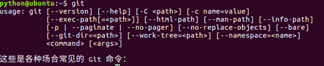

## 3.创建一个版本库（GitHub 上的仓库）

> 新建一个文件夹 git_test，然后进入这个目录（文件夹）执行 `git init`，就变成了一个 Git 仓库了，Git 就可以帮助我们管理这个目录下的代码了。
>
> 执行完 `git init` 之后可以看到在 git_test 目录下创建了一个 `.git` 隐藏目录，这就是版本库目录。
>
> 之后 Git 就会借助这个 `.git` 目录帮助你管理 `git_test` 下的代码。
>
> 普通目录和 Git 目录的区别就在这里，这是我自己的理解，有可能不对，哈哈哈。

(1)   新建一个目录git_test，在git_test目录下创建一个版本库，命令如下：

```shell
git init
```


## 4.版本创建与回退

> 总结版：
>
> 版本创建包括两步：
>
> ```shell
> git add <file>
> git commit -m "提交信息"
> ```
>
> 版本回退两种方式
>
> ```shell
> # 1. 回退到当前版本的前几个版本
> # 一个^表示前一个版本，一次类推，还可以使用 HEAD~1 表示前一个版本依次类推
> git reset --hard HEAD^ 
> # 2. 回退到某个指定的版本
> # 版本号就是 git log 中 commit 后面的40位序列号
> git reset --hard 版本号
> ```

### 4.1   使用

(1)   在git_test目录下创建一个文件code.txt，编辑内容如下：


(2)   使用如下两条命令可以创建一个版本：

> 执行完下面两条命令之后 `code.txt` 就出现在 Git 的历史版本里了。

```shell
git add code.txt
```

```shell
git commit –m '版本1'
```


(3)   使用如下命令可以查看版本记录：

> commit 后面是40位的序列号， 系统会根据修改的内容计算出没有重复的40位英文及数字来给提交命名，通过这个命名，就可以在数据库中找到对应的提交，说白了就是这个提交版本的编号。 
>
> ```shell
> # 查看完整的日志记录
> git log
> # 查看简短的日志记录
> git log --pretty=oneline
> ```

```shell
git log
```


(4)   继续编辑code.txt，在里面增加一行。


(5)   使用如下命令再创建一个版本并查看版本记录：

> 可以看到现在就有两个版本了


(6)   现在若想回到某一个版本，可以使用如下命令：

> 以后再也不用再为备份发愁了，这里所有的修改版本都有，而且可以回到任意一个版本。

```
git reset --hard HEAD^
```

其中HEAD表示当前最新版本，HEAD^表示当前版本的前一个版本,HEAD^^表示当前版本的前前个版本，也可以使用HEAD~1表示当前版本的前一个版本,HEAD~100表示当前版本的前100版本。

现在若觉得想回到版本1，可以使用如下命令：

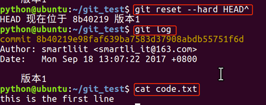

执行命令后使用git log查看版本记录，发现现在只能看到版本1的记录，cat code.txt查看文件内容，现在只有一行，也就是第一个版本中code.txt的内容。

(7)   假如我们现在又想回到版本2，这个时候怎么办？

可以使用如下命令：

```
git reset --hard 版本号
```

从上面可以看到版本2的版本号为：


(8)   在终端执行如下命令：


现在发现版本2有回来了。可以cat code.txt查看其里面的内容如下：


(9)   假如说上面的终端已经关了改怎么回退版本。

我们在执行如下命令将版本回退到版本1。


下面把终端关了，然后再打开终端，发现之前版本2的版本号看不到了。

那么怎么再回到版本2呢？git reflog命令可以查看我们的操作记录。

```
git reflog
```


可以看到版本2的版本号，我们再使用如下命令进行版本回退，版本重新回到了版本2。

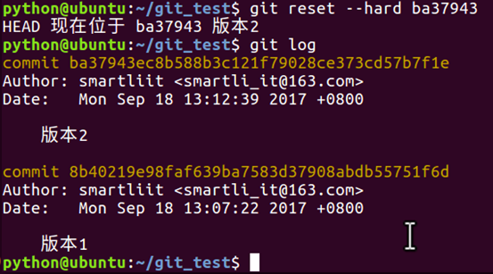

### 4.2 工作区和暂存区

> 工作区：本地电脑中的目录（比如从 Github 上 clone 下来的仓库）
>
> 暂存区：隐藏的目录 `.git` 中称为 stage（或者叫index） 的暂存区。

#### 4.2.1 工作区(Working Directory)

电脑中的目录，比如我们的 `git_test`，就是一个工作区。

#### 4.2.2 版本库(Repository)

工作区有一个隐藏目录.git，这个不是工作区，而是git的版本库。

git的版本库里存了很多东西，其中最重要的就是称为 `stage(或者叫index)的暂存区`，还有 `git `为我们自动创建的第一个分支 `master`，以及指向 `master` 的一个指针叫`HEAD` 。

> 版本回退的时候就有用到 HEAD 呀，HEAD 指向最新提交的版本

因为我们创建git版本库时，git自动为我们创建了唯一一个master分支，所以，现在，`git commit` 就是往 `master` 分支上提交更改。

你可以简单理解为，需要提交的文件修改通通放到暂存区，然后，一次性提交暂存区的所有修改。


前面讲了我们把文件往git版本库里添加的时候，是分两步执行的：

第一步是用 `git add` 把文件添加进去，实际上就是把文件修改添加到**暂存区**；

第二步是用git commit提交更改，实际上就是把暂存区的所有内容提交到当前分支，这个时候就创建了一个版本记录，在 `git log` 就会显示本次提交的版本记录了，而且我们就可以通过回退的方式在之后回退到这个版本记录。

(1)   下面在git_test目录下再创建一个文件code2.txt，然后编辑内容如下：


(2)   然后再次编辑code.txt内容，在其中加入一行，编辑后内容如下：

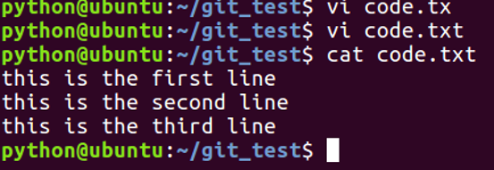

(3)   使用如下命令查看当前工作树的状态：

git status

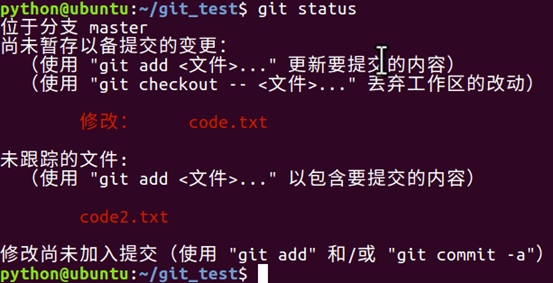

上面提示我们code.txt被修改，而code2.txt没有被跟踪。

(4)   我们使用如下命令把code.txt和code2.txt加入到暂存区，然后再执行git status命令，结果如下：

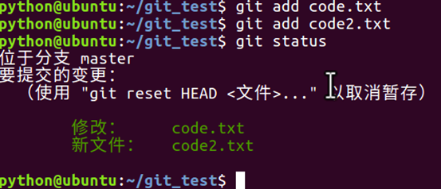

所有git add命令是把所有提交的修改存放到暂存区。

(5)   然后，执行git commit就可以一次性把暂存区的所有修改提交到分支创建一个版本。


(6)   一旦提交后，如果你又没有对工作区做任何修改，那么工作区就是“干净”的。执行如下命令可以发现：

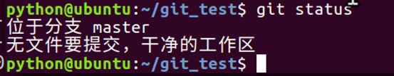

现在我们的版本库变成了这样：


### 4.3 管理修改

git管理的文件的修改，它只会提交暂存区的修改来创建版本。

(1)   编辑code.txt，并使用git add 命令将其添加到暂存区中。


(2)   继续编辑code.txt，并在其中添加一行。


(3)   git commit创建一个版本，并使用git status查看，发现第二次修改code.txt内容之后，并没有将其添加的工作区，所以创建版本的时候并没有被提交。


### 4.4 撤销修改

> 修改过文件之后还没有执行 git add 使用 git checkout -- <file> 会发现内容回到了修改之前。
>
> 现在，如果你将一个改错的文件提交到了暂存区，使用 git reset HEAD <file> 取消暂存

(1) 继续上面的操作，提示我们可以使用 git checkout -- <文件> 来丢弃工作区的改动。执行如下命令，发现工作区干净了，第二次的改动内容也没了。


(2)   我们继续编辑code.txt，并在其中添加如下内容，并将其添加的暂存区。

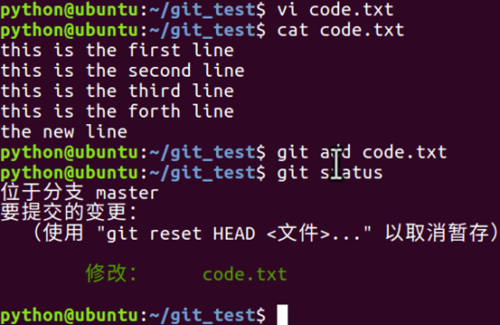

(3)git同样告诉我们，用命令git reset HEAD file可以把暂存区的修改撤销掉，重新放回工作区。


(4)现在若想丢弃code.txt的修改，执行如下命令即可。

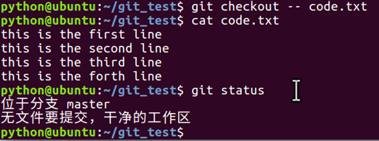

现在，如果你不但改错了东西，还从暂存区提交到了版本库，则需要进行版本回退。

**小结：**

场景1：当你改乱了工作区某个文件的内容，想直接丢弃工作区的修改时，用命令git checkout -- file。

场景2：当你不但改乱了工作区某个文件的内容，还添加到了暂存区时，想丢弃修改，分两步，第一步用命令git reset HEAD file，就回到了场景1，第二步按场景1操作。

场景3：已经提交了不合适的修改到版本库时，想要撤销本次提交，参考[版本回退](https://www.liaoxuefeng.com/wiki/0013739516305929606dd18361248578c67b8067c8c017b000/0013744142037508cf42e51debf49668810645e02887691000)一节。

### 4.5 对比文件的不同

**场景1. 对比工作区和某个版本中文件的不同：**

> ```shell
> git diff 版本号（HEAD表示和最新的版本比较） -- 工作区中的文件
> # 注意下面第二张图中 +并不是比另一个文件多的，- 也并不是比另一个文件少的，而是代表独有的。+ 代表一个文件，- 代表一个文件。
> ```

(1)   继续编辑文件code.txt，在其中添加一行内容。


(2)   现在要对比工作区中code.txt和HEAD版本中code.txt的不同。使用如下命令：


(3)   使用如下命令丢弃工作区的改动。


**场景2. 对比两个版本间文件的不同：**

> ```shell
> # 相比较哪两个版本就输入那两个版本的版本序列号,然后后面跟上这两个版本中的哪个文件
> git diff 版本序列号1 版本序列号2 -- 文件名
> ```

(1)   现在要对比HEAD和HEAD^版本中code.txt的不同，使用如下命令：


### 4.6 删除文件

> 步骤：
>
> 1. 删除某个文件
> 2. 还未add，两种情况：
>    1. 确实删除，执行 `git rm 文件名` 然后 `git commit`
>    2. 不小心删错了，执行 `git  checkout - 文件名` 恢复文件（注意这种情况针对的是这个文件之前已经是版本库的文件，如果是新建的文件还没有 git add 过，那么你删了就是删了。 ）
>
> 3. 已经add
>    1. 确实删除，执行 git rm 文件名 然后 git commit
>    2. 不小心删错了，执行git reset HEAD file(注意这个命令中应该只能写 HEAD，其实有一点不理解 HEAD 不是指向版本库中的最新版本吗？怎么又管暂存区的事了) 然后再执行 git checkout 恢复文件
>
> 4. 已经 commit 
>
>     1. 确实删除， 大哥已经删除了
>
>     2. 不小心删错了，如果之前提交到版本库过，可以 git  reset 版本号 文件名 回退到那个版本，然后文件就恢复了，但是文件内容只能是当时提交时的内容，和你刚删除的文件可能会有所区别。
>
>        56 
>
> 结论：git 真的是很好用呀，使用 git 之后可以很容易地将文件恢复，如果某个文件被加入到版本库中还不用担心文件误删，因为那个版本的文件是可以找回的。

(1) 我们把目录中的code2.txt删除。


这个时候，git知道删除了文件，因此，工作区和版本库就不一致了，git status命令会立刻提示哪些文件被删除了。


(2)   现在你有两个选择，一是确实要从版本库中删除该文件，那就用命令git rm删掉，并且git commit：


另一种情况是删错了，可以直接使用git checkout – code2.txt,这样文件code2.txt又回来了。

**小结：**

命令git rm用于删除一个文件。

如果一个文件已经被提交到版本库，那么你永远不用担心误删，但是要小心，你只能恢复文件到最新版本，你会丢失**最近一次提交后你修改的内容**。

## 5.   分支管理

### 5.1 概念

分支就是科幻电影里面的平行宇宙，当你正在电脑前努力学习Git的时候，另一个你正在另一个平行宇宙里努力学习SVN。

如果两个平行宇宙互不干扰，那对现在的你也没啥影响。不过，在某个时间点，两个平行宇宙合并了，结果，你既学会了git又学会了SVN！


分支在实际中有什么用呢？

**应用场景：**

假设你准备开发一个新功能，但是需要两周才能完成，第一周你写了50%的代码，如果立刻提交，由于代码还没写完，不完整的代码库会导致别人不能干活了。如果等代码全部写完再一次提交，又存在丢失每天进度的巨大风险。

**解决方案：**

现在有了分支，就不用怕了。你创建了一个属于你自己的分支，别人看不到，还继续在原来的分支上正常工作，而你在自己的分支上干活，想提交就提交，直到开发完毕后，再一次性合并到原来的分支上，这样，既安全，又不影响别人工作。

### 5.2 创建与合并分支

> 总结版：
>
> 1. 查看分支
>
>    ```shell
>    # 查看分支，*表示当前所在的分支
>    git branch
>    ```
>
> 2. 创建分支
>
>    ```shell
>    git branch 分支名 
>    # 创建一个 dev 分支（**创建了一个 dev 指针指向当前分支**）
>    git branch dev
>    ```
>
> 3. 切换分支
>
>    ```shell
>    git checkout 分支名
>    # 切换到 dev 分支（将 HEAD 指针指向 dev 分支）
>    git checkout dev
>    ```
>
> 4. 创建分支并切换到新创建的分支
>
>    ```shell
>    # 创建 dev 分支（新创建一个 dev 指针指向当前分支），并且切换到 dev 分支（将 HEAD 指针指向 dev 分支）
>    git checkout -b dev
>    ```
>
> 5. 合并分支
>
>    ```shell
>    # 合并 dev 分支到当前分支（快速模式下是挪动指针，比如将master指针指向dev指针，问题在于谁指向谁的问题，既然是合并，那么我感觉是合并内容之后谁最后修改的就指向谁，因为这样可以保证指向的是最新的分支，内容不会遗漏。）
>    git merge dev
>    ```
>
> 6. 删除分支
>
>    ```shell
>    # 删除 dev 分支（将 dev 指针删除掉）
>    git branch -d dev
>    ```

git把我们之前每次提交的版本串成一条时间线，这条时间线就是一个分支。截止到目前只有一条时间线，在git里，这个分支叫主分支，即master分支。

HEAD严格来说不是指向提交，而是指向master，master才是指向提交的。

所以，**HEAD指向的就是当前分支，HEAD指向哪里就表示自己现在所处的分支是哪一个。**

> 比如从回退的时候去理解 `git reset --hard HEAD^` ，这条命令并没有指明某个具体的分支，说明对任何分支都适用。你所在的是哪一个分支，就会在哪一个分支下回退。

(1) 一开始的时候，master分支是一条线，git用master指向最新的提交，再用HEAD指向master，就能确定当前分支，以及当前分支的提交点：

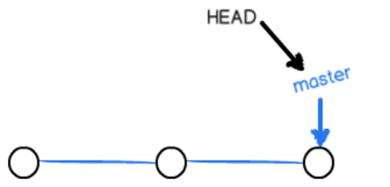

每次提交，master分支都会向前移动一步，这样，随着你不断提交，master分支的线也越来越长。

(2)当我们创建新的分支，例如dev时，git新建了一个指针叫dev，指向master相同的提交，再把HEAD指向dev，就表示当前分支在dev上：


git创建一个分支很快，因为除了增加一个dev指针，改变HEAD的指向，工作区的文件都没有任何变化。

(3)不过，从现在开始，对工作区的修改和提交就是针对dev分支了，比如新提交一次后，dev指针往前移动一步，而master指针不变：


(4)假如我们在dev上的工作完成了，就可以把dev合并到master上。git怎么合并呢？最简单的方法，就是**直接把master指向dev的当前提交，就完成了合并**：


git合并分支也很快，就改改指针，工作区内容也不变。

(5)合并完分支后，甚至可以删除dev分支。**删除dev分支就是把dev指针给删掉**，删掉后，我们就剩下了一条master分支：


案例：

(1)**查看分支**

```shell
# 查看分支，*表示当前所在的分支
git branch
```

执行如下命令可以查看当前有几个分支并且看到在哪个分支下工作。


(2)**创建分支并切换分支**

```shell
git checkout -b 分支名 
# 创建一个 dev 分支（创建了一个 dev 指针指向当前分支），并切换到 dev 分支（HEAD 指针指向 dev）
git checkout -b dev
```

下面创建一个分支dev并切换到其上进行工作。


(3)下面我们修改code.txt内容，在里面添加一行，并进行提交。

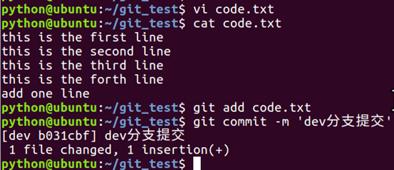


(4)dev分支的工作完成，我们就可以切换回master分支：


查看code.txt，发现添加的内容没有了。因为那个提交是在dev分支上，而master分支此刻的提交点并没有变：

(5)现在，我们把dev分支的工作成果合并到master分支上：


git merge 命令用于合并指定分支到当前分支。合并后，再查看code.txt的内容，就可以看到，和 dev 分支的最新提交是完全一样的。

注意到上面的Fast-forward信息，Git告诉我们，这次合并是“快速模式”，也就是直接把master指向dev的当前提交（master指针指向dev），所以合并速度非常快。

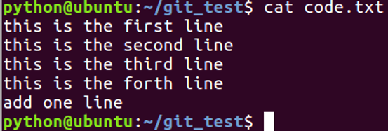

(6)合并完成后，就可以放心地删除dev分支了，删除后，查看branch，就只剩下master分支了。


小结：

查看分支：git branch

创建分支：git branch <name>

切换分支：git checkout <name>

创建+切换分支：git checkout -b <name>

合并某分支到当前分支：git merge <name>

删除分支：git branch -d <name>

### 5.3 解决冲突

> 场景：
>
> 对同一个文件在不同的分支上做了不同的修改并且进行了提交。
>
> 解决办法：
>
> 打开冲突文件，根据提示进行手动合并，合并完成之后进行新的提交。
>
> 合并完成后可以选择删除掉一个分支。

合并分支往往也不是一帆风顺的。

(1)再创建一个新分支dev。

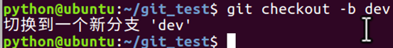

(2)修改code.txt内容，并进行提交。


(3)切换回master分支。


(4)在master的code.txt添加一行内容并进行提交。

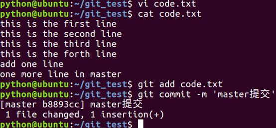

现在，master分支和dev分支各自都分别有新的提交，变成了这样：


这种情况下，git无法执行“快速合并”，只能试图把各自的修改合并起来，但这种合并就可能会有冲突。

(5)执行如下命令尝试将dev分支合并到master分支上来。

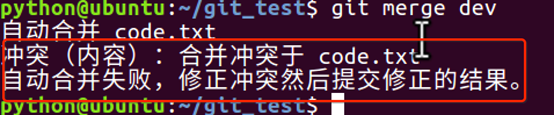

git告诉我们，code.txt文件存在冲突，必须手动解决冲突后再提交。

(6)git status也可以告诉我们冲突的文件：


(7)查看code.txt的内容。


(8)git用<<<<<<<，=======，>>>>>>>标记出不同分支的内容，我们修改如下后保存：


(9)再提交。

(10)  现在，master分支和dev分支变成了下图所示：

**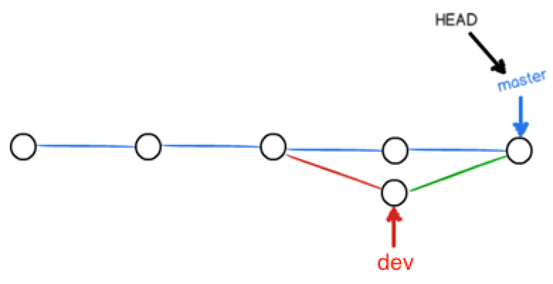**

(11)用带参数的git log也可以看到分支的合并情况：

****

(12)最后工作完成，可以删除dev分支。

****

### 5.4 分支管理策略

通常，合并分支时，如果可能，git会用fast forward模式，但是有些快速合并不能成而且合并时没有冲突，这个时候会合并之后并做一次新的提交。但这种模式下，删除分支后，会丢掉分支信息。

(1)创建切换到dev分支下。

****

(2)新建一个文件code3.txt编辑内容如下，并提交一个commit。


(3)切换回master分支，编辑code.txt并进行一个提交。


(4)合并dev分支的内容到master分支。


(5)出现如下提时，这是因为这次不能进行快速合并，所以git提示输入合并说明信息，输入之后合并内容之后git会自动创建一次新的提交。


 


(6)使用分支命令查看分支信息。

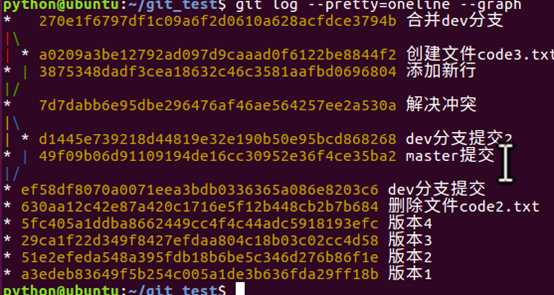

(7)删除dev分支。


 

 

 

 

如果要强制禁用fast forward模式，git就会在merge时生成一个新的commit，这样，从分支历史上就可以看出分支信息。

(1)创建并切换到dev分支。

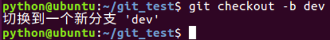

(2)修改code.txt内容，并提交一个commit。

**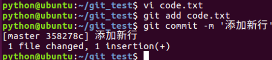**

(3)切换回master分支。

**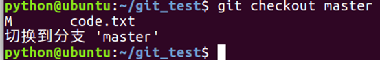**

(4)准备合并dev分支，请注意--no-ff参数，表示禁用Fast forward：

****

因为本次合并要创建一个新的commit，所以加上-m参数，把commit描述写进去。

(5)合并后，我们用git log看看分支历史：

可以看到，不使用Fast forward模式，merge后就像这样：


****

 

### 5.5 Bug分支

软件开发中，bug就像家常便饭一样。有了bug就需要修复，在git中，由于分支是如此的强大，所以，每个bug都可以通过一个新的临时分支来修复，修复后，合并分支，然后将临时分支删除。

(1)当你接到一个修复一个代号001的bug的任务时，很自然地，你想创建一个分支bug-001来修复它，但是，等等，当前正在dev上进行的工作还没有提交：

****

并不是你不想提交，而是工作只进行到一半，还没法提交，预计完成还需1天时间。但是，必须在两个小时内修复该bug，怎么办？

(2)git还提供了一个stash功能，可以把当前工作现场“储藏”起来，等以后恢复现场后继续工作：

**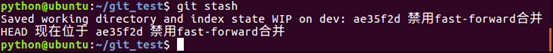**

(3)首先确定要在哪个分支上修复bug，假定需要在master分支上修复，就从master创建临时分支：

****

(4)现在修复bug,把 the new line删掉，然后提交。

****

(5)修复完成后，切换到master分支，并完成合并，最后删除bug-001分支。


(6)现在bug-001修复完成，是时候接着回到dev分支干活了！


(7)工作区是干净的，刚才的工作现场存到哪去了？用git stash list命令看看：


作现场还在，git把stash内容存在某个地方了，但是需要恢复一下.

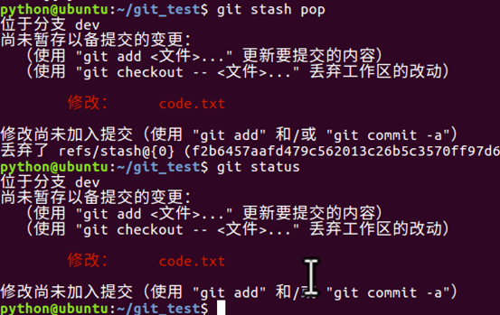

**小结：**

修复bug时，我们会通过创建新的bug分支进行修复，然后合并，最后删除；

当手头工作没有完成时，先把工作现场git stash一下，然后去修复bug，修复后，再git stash pop，恢复工作现场。

## 6.   使用github

### 6.1 创建仓库

(1)注册github账户，登录后，点击"New respository "


 

 

 

 

(2)在新页面中，输入项目的名称，勾选'readme.md'，点击'create repository'


(3)添加成功后，转到文件列表页面.


### 6.2 添加ssh账户

(1)点击账户头像后的下拉三角，选择'settings'

 

如果某台机器需要与github上的仓库交互，那么就要把这台机器的ssh公钥添加到这个github账户上

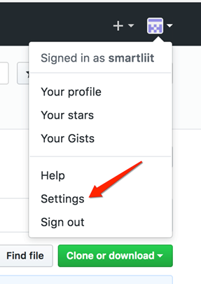

点击'SSH and GPG keys'，添加ssh公钥。


(2)在ubuntu的命令行中，回到用户的主目录下，编辑文件.gitconfig，修改某台机器的git配置。

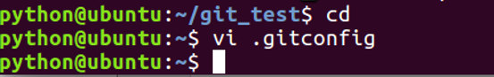

(3)修改为注册github时的邮箱，填写用户名。


(4)使用如下命令生成ssh密钥。

```
ssh-keygen -t rsa -C "邮箱地址"
```


(5)进入主目录下的.ssh文件件，下面有两个文件。

公钥为id_rsa.pub

私钥为id_rsa

查看公钥内容，复制此内容


(6)回到浏览器中，填写标题，粘贴公钥


### 6.3 克隆项目

(1)在浏览器中点击进入github首页，再进入项目仓库的页面


(2)复制git地址

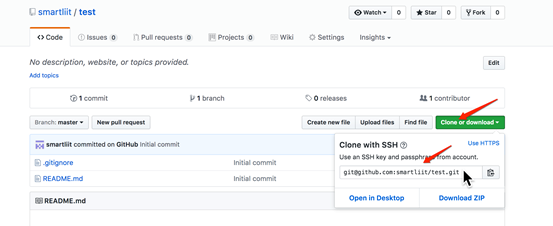

(3) 克隆出错


(4)在命令行中复制仓库中的内容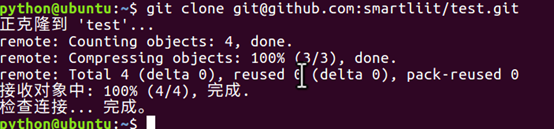

### 6.4 上传分支

(1)项目克隆到本地之后，执行如下命令创建分支smart.


(2)创建一个code.txt并提交一个版本。


(3)推送前github上文件列表如下图


(4)推送前github上分支列表如下图


(5)推送分支，就是把该分支上的所有本地提交推送到远程库，推送时要指定本地分支，这样，git就会把该分支推送到远程库对应的远程分支上

```
git push origin 分支名称
```

例：

```
git push origin smart
```


(6)再去github网站上去看分支页面，内容如下。

 


### 6.5 将本地分支跟踪服务器分支

```
git branch --set-upstream-to=origin/远程分支名称 本地分支名称
```

例：

```
git branch --set-upstream-to=origin/smart smart
```


### 6.6 从远程分支上拉取代码

```
git pull orgin 分支名称
```

例：

```
git pull orgin smart
```

使用上述命令会把远程分支smart上的代码下载并合并到本地所在分支。

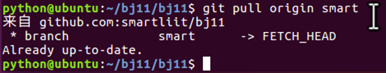

## 7.   工作使用git

**项目经理：**

(1) 项目经理搭建项目的框架。

(2) 搭建完项目框架之后，项目经理把项目框架代码放到服务器。

**普通员工：**

(1)   在自己的电脑上，生成ssh公钥，然后把公钥给项目经理，项目经理把它添加的服务器上面。

(2)   项目经理会给每个组员的项目代码的地址，组员把代码下载到自己的电脑上。

(3)   创建本地的分支dev,在dev分支中进行每天的开发。

(4)   每一个员工开发完自己的代码之后，都需要将代码发布远程的dev分支上。


Master:用户保存发布的项目代码。V1.0,V2.0

Dev:保存开发过程中的代码。