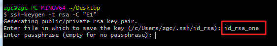
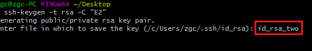
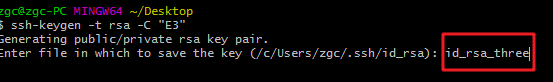
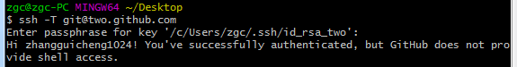

# 实现在一台电脑上同时使用多个GitHub账号

> 亲测有效，麻烦在做的时候慢一点认真一点，如果不行来找我。

每个程序员都可能有多个GitHub账号，今天就和大家聊一下如何在一台电脑上同时使用多个 GitHub 账号，通过以下四个步骤就可以实现。

## 1. 取消全局配置

> 如果想在一台电脑上使用多个 GitHub 账号，使用全局配置是不行的。如果使用全局配置的话，那么每次使用 git 命令时都会使用这个全局的用户名和邮箱，就没有办法区分不同的 GitHub 账号了。

在最开始使用GitHub配置ssh时，大部分人都使用过下面这两条语句：

```js
git config --global user.name "你的用户名"
git config --global user.email "你的邮箱"
```

这两条命令是在进行全局配置，对于想要在一台电脑上使用多个GitHub账号是不行的，需要利用下面的两条语句来取消全局配置。

```js
git config --global --unset user.name
git config --global --unset user.email
```

> 上面的命令直接赋值粘贴输入就好了，不需要将 user.name 修改成你的用户名。

## 2. SSH

### 2.1 生成ssh

> 本地仓库是通过 ssh 的方式和远程 GitHub 仓库建立连接的，所以我们要生成 ssh 私钥和公钥。私钥放在本地，公钥复制粘贴到 GitHub 的 SSH 设置中。这样当公钥和私钥配对时，连接就建立了。
>
> 由于我们想使用多个 GitHub 账号，所以我们就需要建立多个公钥和私钥。

在这里假设我们有三个 GitHub 账号想在一台电脑上同时使用，三个账号分别为：ID1，ID2，ID3(ID1,ID2,ID3即为下图中的名字，比如我的 ID1 就是 `happyCoding1024`)，对应的邮箱分别为E1，E2，E3，现在需要生成三个ssh。


> ID1, ID2, ID3 是Github的用户名。
>
> E1, E2, E3 是与 GitHub 用户名对应的邮箱。

生成第一个ssh：

在桌面打开GitBash或者cmd(在桌面按住shift键再按右键或弹出在此处打开命令窗口)

```js
ssh-keygen -t rsa -C "E1"
```

运行到这一步时输入红色方框中的内容 `id_rsa_one` ，表示第一个私钥。



> 红色方框中的内容需要自己输入，表示的是第一个私钥的名称。
>
> 紧接着会让你输入密码

生成第二个ssh：

紧接着运行下面这条语句：

```js
ssh-keygen -t rsa -C "E2"
```

在红色方框中输入 `id_rsa_two`



生成第三个ssh：

再运行下面这条语句：

```js
ssh-keygen -t rsa -C "E3"
```

在红色框中输入 `id_rsa_three`



至此三个ssh生成完毕。

将三个公钥文件 `id_rsa_one.pub` `id_rsa_two.pub` `id_rsa_three.pub` (默认路径 `C:\Users\你的用户名\.ssh` )分别复制粘贴到三个GitHub账号的ssh key中。

> 这一步很简单打开 GitHub 中的设置选择 SSH key ，点击添加即可，这一步也可以自行百度，只需点几下鼠标就可以了。

### 2.2 添加私钥

> 由于现在取消了全局配置，所以需要将私钥加到 ssh 中，这样当用到的时候 ssh 才能够识别出来。

1、打开**ssh-agent**
(1)如果你是github官方的bash：

```js
ssh-agent -s
```

(2) 如果你是其它，比如msysgit：

```js
eval $(ssh-agent -s)
```

> 一般情况下第二种是好用的。

第一种如果不行就尝试第二种，成功的截图如下图所示：


2、添加私钥

```js
ssh-add ~/.ssh/id_rsa_one

ssh-add ~/.ssh/id_rsa_two

ssh-add ~/.ssh/id_rsa_three
```

> 如果生成ssh 密钥就按照本文的命名方式那么将上面的代码复制粘贴回车就好，否则需要将名称改成你自己设置的私钥名称。

### 2.3 修改config文件（核心）

> 由于在最开始的时候取消了全局配置，所以在这个要配置一下 ssh 的 config 文件，目的就是告诉 ssh 访问某个 GitHub 账号需要使用哪一个私钥。

在 `.ssh` 文件夹下运行GitBash，生成 `config` 文件。

```js
touch config
```

打开 `config` 文件，将以下内容复制到 `config` 文件中。

```js
# 第一个
Host one.github.com
HostName github.com
User ID1 # 用户名1
IdentityFile ~/.ssh/id_rsa_one

# 第二个
Host two.github.com  # 前缀名可以任意设置
HostName github.com
User ID2 # 用户名2
IdentityFile ~/.ssh/id_rsa_two

# 第三个
Host three.github.com  # 前缀名可以任意设置
HostName github.com
User ID3 # 用户名3
IdentityFile ~/.ssh/id_rsa_three
```

如果 `Host` 始终为 `github.com` ，那么就只能使用一个私钥。通过上面的设置，每个 GitHub 账号都有一个自己的 HOST(这样就区分出了不同的 GItHub 账号)，但是每个 Host 的域名(HostName)做 CNAME 解析又都解析到 github.com(这样可以保证访问的是 GitHub, 如果你想访问码云，那么就改成码云的域名即可)。这样 SSH 就可以通过不同的 Host 区分出不同的 GitHub 账号，然后使用 Host 对应的私钥和远程的 GitHub 仓库进行连接。

> `Host one.github.com`  前缀名 one 可以随意设置
> `HostName github.com` 如果要连接的远程仓库是 GitHub 保持不变，如果是其它的远程仓库就改成相应的域名 
> `User ID1`  ID1 表示用户名，可以就写 GitHub 的用户名
> `IdentityFile ~/.ssh/id_rsa_one`  最后的 id_rsa_one 表示的是私钥名称。

### 2.4 测试

```js
ssh –T git@one.github.com

ssh –T git@two.github.com

ssh –T git@three.github.com
```

如果出现下图，则说明成功：



> 做到这一步 ssh 的部分就差不多完成了，下面是和 GitHub 有关的部分，胜利就在眼前。

## 3. 配置本地项目

### 3.1 从远程仓库 clone 仓库

> 如果 clone 一次不成功就多试几次，有时候会出现 time out 的提示。

注意与之前的操作有所变化：

例如我要克隆的远程仓库的 ssh 地址是：`git@github.com:happyCoding1024/FrontendLearningTool.git`

假设这个远程仓库是在 GitHub 账号为 ID1 的仓库中，那么克隆时需要改成下面的形式：

```shell
git clone  git@one.github.com:happyCoding1024/FrontendLearningTool.git
```

> 关于为什么是这样我的理解是这样的：
>
> 通过之前 2.3 节配置好的`config` 文件可知， 当访问 `git@one.github.com` 时本地进行域名解析时解析成 `git@github.com` 经过这样的解析之后就和远程仓库的 ssh 地址对应上了因此可以访问到远程仓库，而且当进行这一步时通过 config 配置文件可知这也告诉了要使用的是哪一个 私钥。
>
> 这样一来 ssh 地址是对的，私钥也能和对应的 GItHub 账号中的 SSH 公钥配对，那么就可以正常地从远程仓库克隆了。

当克隆成功后这个时候，在控制台中运行

```shell
git remote -v
```

你会发现输出下面的内容：

```shell
origin  git@one.github.com:happyCoding1024/FrontendLearningTool.git (fetch)
origin  git@one.github.com:happyCoding1024/FrontendLearningTool.git (push)
```

> 如果输出内容不是上面这样，那么你需要修改远程仓库的 origin （只要是clone成功了一般不会下面的情况）
>
> 方法如下：
>
> ```shell
> git remote rm origin # 先删掉远程仓库原来的origin
> git remote add origin git@one.github.com:happyCoding1024/FrontendLearningTool.git # 重新将远程仓库命名为origin，并将地址（git@one.github.com:happyCoding1024/FrontendLearningTool.git）赋值给 origin，这个地址经过解析后就是 git@github.com:happyCoding1024/FrontendLearningTool.git。
> ```

本地 SSH 根据 config 文件的配置通过 one.github.com 可以确定使用哪一个私钥和远程仓库的公钥进行配对，经过域名解析后又可以连接到远程真正的仓库地址 `git@github.com:happyCoding1024/FrontendLearningTool.git`。

所以如果以后出现问题，首先要通过 `git remote -v` 命令，查看是不是配置文件中的域名，如果结果是下面这样，就说明有问题了。

```shell
origin  git@github.com:happyCoding1024/FrontendLearningTool.git (fetch)
origin  git@github.com:happyCoding1024/FrontendLearningTool.git (push)
```

因为这是之前使用全局设置的时候运行 `git remote -v` 应该输出的内容，没有 `one.git.com` 就无法辨别应该使用哪一个私钥和 Github 仓库中的公钥配对。

### 3.2 修改本地仓库的用户名和邮箱

> 由于现在不是全局配置了，所以每个仓库都需要配置各自的用户名和邮箱来确定这个仓库是和哪个 GitHub 账号连接的。

在项目文件夹中右键打开 `GitBash`，然后执行下面 的语句，设置账号和相应的项目关联：

```js
git config user.name  "ID1"
git config user.email  "E1"
```

> ID1: 指的是 GitHub 用户名
>
> E1: 指的是和这个 GitHub 账号关联的邮箱 

## 4. 提交

恭喜，到达这步之后，就已经和远程仓库建立好连接了， 这个时候随便新建一个文件进行一下 push 操作尝试一下吧。 

```shell
# 新建一个 test.txt 文件
touch test.txt
```

将这个文件提交到远程仓库：

```js
git add test.txt
git commit -m "commit test.txt"
git push -u origin master
```

> 建议使用 git push 的时候尽量写完整，也不会很费事，不要直接写成 git push，因为以后默认只能推送到master分支，以后有可能还要推送到其它分支。
>
> -u 参数可以在推送的同时，将 origin 仓库的 master 分支设置为本地仓库当前分支的 upstream， 添加了这个参数之后，将来运行 git pull 命令从远程仓库获取内容时，本地仓库的这个分支就可以直接从 origin 的 master 分支获取内容，省去了另外添加参数的麻烦。

完，如有不恰当之处，欢迎指正哦。
