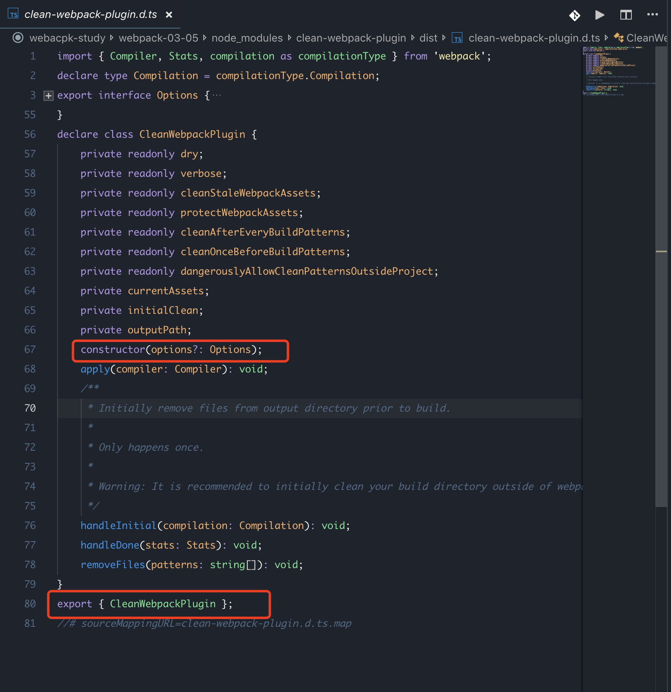

# **cleanWebpackplugin 升级踩坑**

> 原文链接： http://www.imooc.com/article/289614 

新版的clean-webpack-plugin 做了以下调整

##### 1.导出方式

现在不是默认导出，所以 引入的时候需要注意一下～否则会抛出这样一个异常

##### TypeError: CleanWebpackPlugin is not a constructor

```js
#const CleanWebpackPlugin = require('clean-webpack-plugin'); // installed via npm

# 引用的时候需要用对象解构

const { CleanWebpackPlugin } = require('clean-webpack-plugin'); // installed via npm
```



##### 2.构造方法

现在构造函数需要传入一个对象 否则会抛出异常

##### Error: clean-webpack-plugin only accepts an options object.

```js
# 以前这样传入，现在不行咯～

# new CleanWebpackPlugin(['dist'], {}),

# 直接不传也是可以的，他会取默认值

new CleanWebpackPlugin()
```

#### 关于clean-webpack-plugin 的配置项

```js
new CleanWebpackPlugin({

dry: false,#默认false dry为true时，模拟删除，加删除，不会真的删掉文件

verbose :false, # 默认false verbose为true时 显示日志， 当dry为true时，总是会打印日志，不管verbose是什么值

cleanStaleWebpackAssets:true #自动删除未被使用的webpack资源

#cleanOnceBeforeBuildPatterns打包前做的一些事，

#忽略掉不需要删除的文件，相当于exclude,被忽略的文件需要在开头加上 "!"号，数组中必须带有"**/*"通配符

#否则dist下的文件都不会被删除

# 删除指定文件/文件夹 path.resolve(__dirname, 'test6')

cleanOnceBeforeBuildPatterns: [

path.resolve(__dirname, 'test6'),

"**/*", "!1.js", "!images",

path.resolve(__dirname, 'test5')

],
})
```

