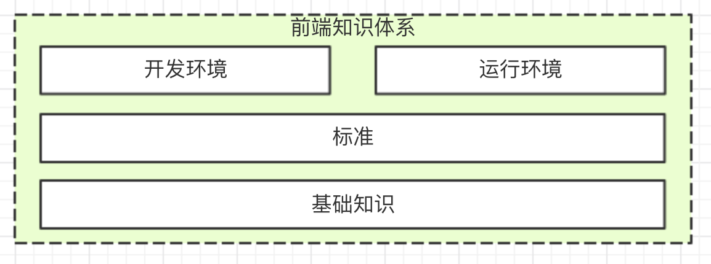
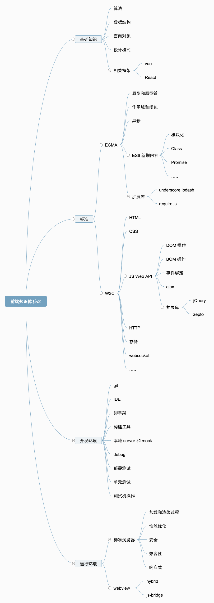

# Web 前端知识体系整理

> 原文链接： http://www.imooc.com/article/44129 

**前言**

现在是信息时代，经过 web1.0 时期、web2.0 时期到现在的移动互联网时期，信息获取越来越高效，坐着不动就会有大量的新闻、博客、资讯向你推荐而来。作为一名靠谱的程序员，你免不了要查阅大量的文章、视频和书籍来充斥你的知识量，不断学习。但是现在网上大量的信息堆积起来，对于你来说意味着什么？你如何去合理的筛选、梳理这些获得的信息，又如何去知道自己现在还缺什么信息？

到这里就应该提出本文的主题 —— **知识体系** 。其实无论针对哪个知识领域，它都是有一套完整的、成型的知识体系和标准作为支撑的，例如数学、建筑、医学、机械等等，当然包括计算机编程，其中肯定包括前端开发。

有了完善的知识体系，再来面对大量的信息获取，你就知道每个信息所说的知识点是属于知识体系中的哪个部分。同时，你也会很清楚自己哪些部分掌握的好，哪些部分掌握的不好，甚至哪些部分自己压根都没听说过。

**如何构建知识体系**

> 学习新的知识并不难，真正难的是你不知道自己现在还有哪些需要去学。

你也许学过 html css js jQuery webpack vue React nodejs git linux 设计模式 算法 …… 等各种前端开发需要的很多知识和技术，但是他们之间到底应该怎么联系起来，能形成怎样的知识网络。以及，在这个知识网络中，还有哪些是你没有考虑到或者学会的。这确实是一个问题，需要你去主动思考，而且还要找到正确的方法。

下面向各位读者分享一下我的分析方法。不过需要说明，这个问题的分析方法没有标准答案，因此我的方法也不见得是最正确的，因此仅供参考。

### 基础知识

也许你听过 `程序 = 算法 + 数据结构` 这句话，那么这句话是针对哪种开发人员说的呢？是写 js 的、写 java 的还是写 C++ ？答案是针对所有的程序员，无论你是前端、客户端、server 端，都适用。那么这些针对所有程序员都适用的东西，就称之为基础知识。

一般来说基础知识分为：

- 算法
- 数据结构
- 面向对象思想
- 设计模式

这部分我觉得是前端程序员最容易忽略的，因为只有复杂的逻辑处理才能让这些知识有用武之地。从前端的最初时代到 jQuery 时代，受限于网速、浏览器、JS 引擎这些限制，JS 基本就是一个脚本，验证一下表单、操作一下 DOM、修改一下样式 ，没有什么复杂的业务逻辑。

但是现在不一样了，网速越来越快、浏览器和 JS 引擎足够强大，而且 vue React 等框架流行开来，使得前端 JS 的业务逻辑越来越大，这些基础知识必须掌握。最后别忘了，nodejs 都盛行多年了，这可让 JS 运行到 server 了，和 php java 等干一样的事情。

最后补充一句。其实编程基础也不止这几个，像编码、编译原理、计算机组成、网络等这些都是基础，但是并不会和前端开发直接相关（或者和我们日常开发相关性不大），这里就不再深究了。有兴趣的读者，可以自己继续补充。

### 标准

为何要用 `var` 定义变量？为何使用 `document.getElementById` 可以获取元素对象？你也许会回答：“浏览器就这么规定的”。那么继续追问，浏览器为何这么规定？而且偏偏那么多款浏览器都是这样统一约定好的？—— 答案是有一些统一的标准限定着它们，浏览器必须按照这些标准来解析 JS HTML CSS 等语法。

> 如果浏览器不按照这些标准来解析怎么办？—— 请参见之前臭名昭著、现在没落的 IE 浏览器

第一个标准是 [ECMA-262 标准](http://www.ecma-international.org/publications/standards/Ecma-262.htm) ，JS 和 ES6 的基本词法、语法都是这个标准来制定且推行的。忽略细节，其中比较重要的有：

- 原型和原型链
- 作用域和闭包
- 异步
- ES6 的新增语法（如模块化、Class、Promise 等）

第二个标准是 [W3C 标准](https://www.w3.org/) ，除了 JS 和 ES6 基础语法，其他常用的功能都是这个标准制定的，主要的包括：

- HTML
- CSS
- Javascript Web API （例如 DOM 操作、BOM 操作、事件绑定、ajax 等）
- HTTP 协议
- 存储
- websocket
- JSON 和 XML
- 2D 3D

**标准一方面指导开发人员如何写代码，一方面指导浏览器如何运行代码**。即，代码和浏览器之间，就靠这个标准来紧密相连。

### 开发环境

开发环境是比较多变而且复杂的，也是最不好总结的一部分，每个公司或者团队使用的工具和环境可能都不一样。但是根据我们日常开发的基本顺序，可以概括为以下几点：

- 代码版本管理，如 git
- IDE ，如 sublime vscode vim 等
- 脚手架，如 vue-cli
- 构建工具，如 webpack
- 本地服务和 mock ，如 webpack-dev-server
- debug ，如用到 chrome 开发者工具、抓包、代理等
- 部署提测，各个公司都不一样，基本原理都是将代码压缩然后上传到测试机
- 单元测试
- 有时需要操作测试机，需要掌握 linux 基础命令

### 运行环境

暂时先不考虑 nodejs 的话，前端代码的运行环境主要分为两种。第一种是标准的浏览器环境，即运行在我们常见的浏览器中。此处需要考虑的问题是：

- 加载和渲染过程，如面试中常被问的“请描述从输入 url 到呈现出页面的整个过程”
- 性能优化，如何更快的加载，如何更快的解析和渲染
- 安全问题，常见的有 XSS 和 CSRF
- 浏览器兼容性
- 响应式布局

第二种是运行在非标准的浏览器环境，即一个特定 app 的 webview 中。例如页面在微信中展示，或者 hybrid 形式。这种情况除了要考虑上述的几个问题之外，还应该再考虑：

- hybrid 如何发布和更新，虽然这是一个前端、server 端和客户端共同解决的问题
- js-bridge 的使用和原理，例如微信 JSSDK 的使用

### 框架和库

以上四个部分总结完之后，你会发现遗漏了一块很重要的内容，就是框架和类库，例如 vue React jQuery underscore 等。这也是我自己在总结过程中遇到的一个问题。

如果你不仔细思考的话，你会很容易将“框架和库”列为第五项，和前四项并列，但是我不敢苟同。让我们来仔细分析以下就知道了，就拿列出的这四个例子：

- vue 最主要的功能就是 MVVM 和组件化。 MVVM 是 MVC 的一种变异或者微创新，MVC 又是设计模式的一种组合形式，因此 MVVM 肯定是和设计相关的。组件化和面向对象基本都是同一个思想，是面向对象思想在前端 view 层应用的一种体现，因此组件化是和面向对象相关的。最后，vue 这个框架，其实是设计、面向对象的一种具体体现，它应该归属于基础知识的一部分。包括它的依附项目，如 vuex vue-router 等。
- React 和 vue 同理，只不过是更加纯粹的组件化，没有 MVVM ，这里不再赘述。
- jQuery 功能丰富，其 API 光标题就能沾满一页。我们最常用的就是 DOM 操作和 ajax
  ，从上面分析得知这两者都是 JS Web API 的内容。因此 jQuery 应该属于 JS Web API 这部分。
- underscore 或者 lodash ，就是一个基础函数库，它只和最基础的语法有关，因此它应该属于 ECMA 标准的一个扩充。

最后再想一下，如果真的把“框架和库”作为第五项单独拿出来，前端开发中可用的框架和库那么多，不得把这部分给撑爆了？—— 这样明显不是一个合理的设计。**任何框架和库的出现，都是为了满足我们日常开发的效率和设计，说白了都是对已有方式的一种改进和补充（因为基础和标准不常变）**，因此上文中的前四项，肯定能找到它们各自的位置。

大家都对号入座，而不是扎堆在一起。这才是合理的设计。

**知识体系脑图**

经过上文的分析，现画出一个最终的脑图，做一个汇总。不过这个图的粒度还是太粗，读者可以继续细化、完善，然后欢迎共享给大家。

**总结**

与其说本文提供了[一个前端知识体系](https://coding.imooc.com/class/190.html?mc_marking=ee24e06c9d52f85746f87c10045ffe4b&mc_channel=shouji)，不如说提供了一个分析和完善知识体系的方法，很希望能看到各位读者能继续完善并总结出自己的知识体系。

其实还有很多[前端涉及的知识](https://coding.imooc.com/class/190.html?mc_marking=ee24e06c9d52f85746f87c10045ffe4b&mc_channel=shouji)没有体现到该图中，如 server 端的 nodejs ，和客户端结合的 PWA RN 等，这些我还在思考如何以更加合理的方式纳入到体系中。