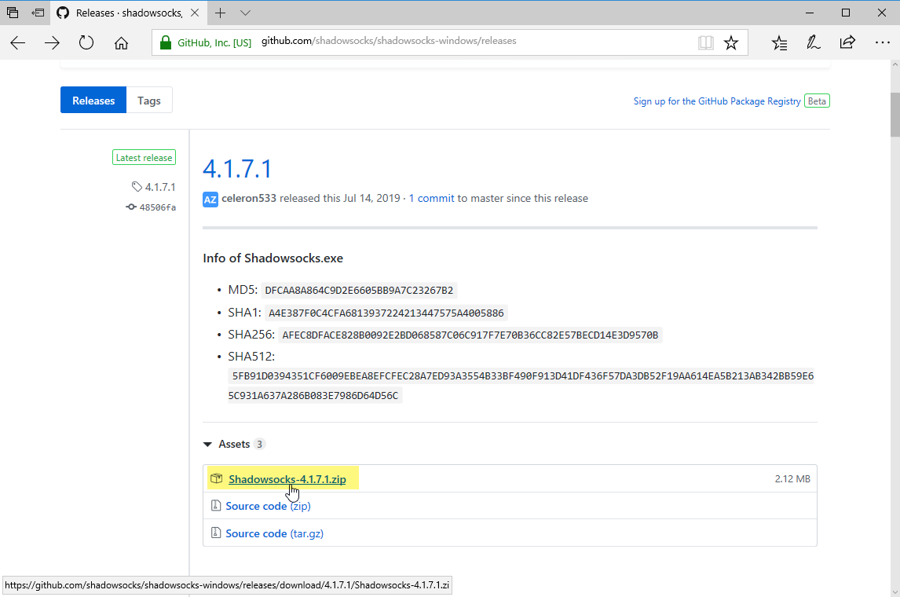
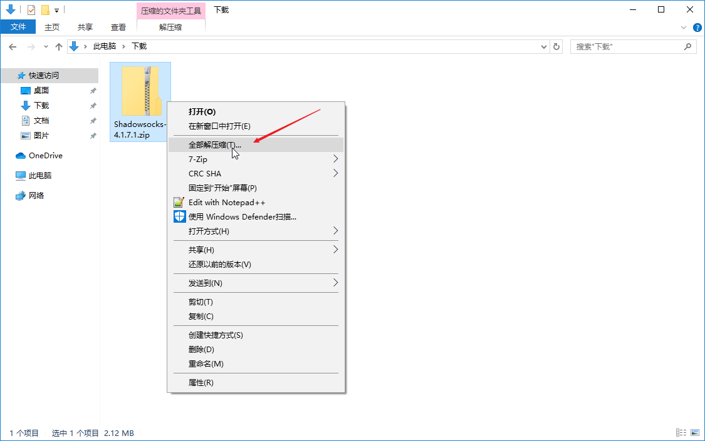
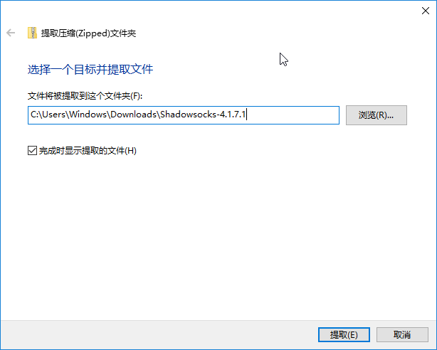
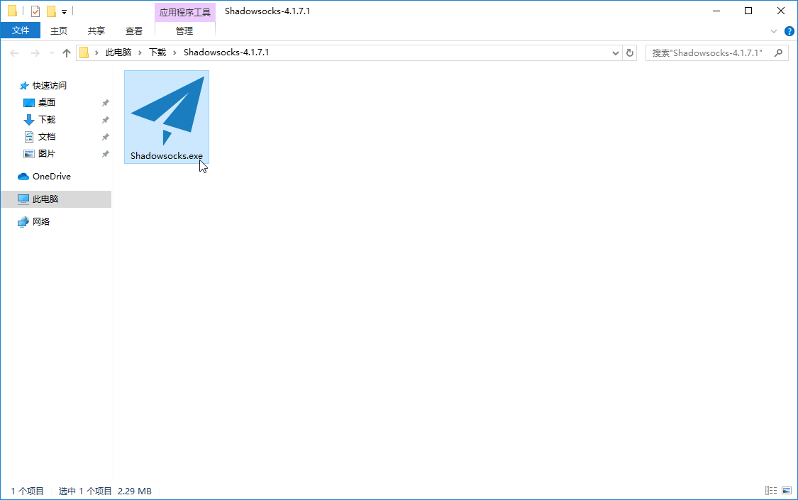
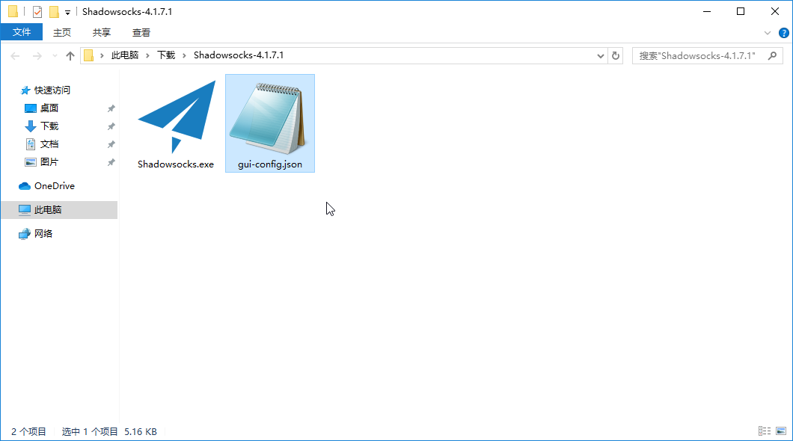
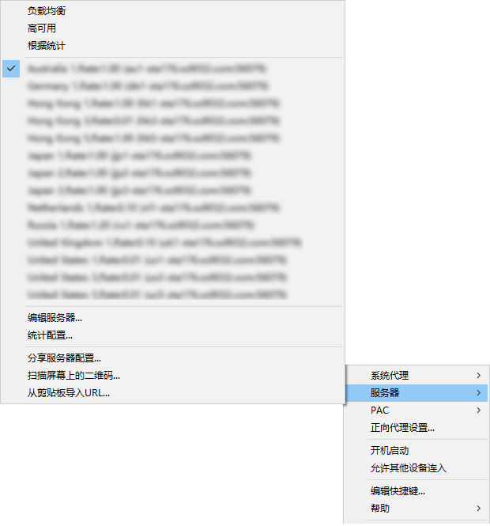
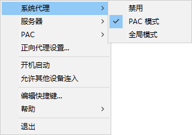
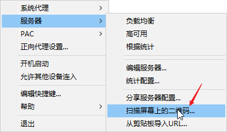
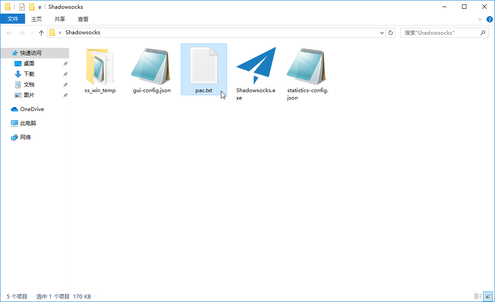

# Shadowsocks 客户端设置教程 - Windows

## 系统要求

**在安装之前，请始终确保您的系统满足最低系统要求。**

您需要具备 Windows 7 SP1 或更高版本才能运行 Shadowsocks。如果您的操作系统版本较旧， 则请先升级到 Windows 7 SP1 或更高版本。

**NET Framework**: 如果你的计算机未安装.NET Framework, 请点击 [这里](https://www.microsoft.com/zh-tw/download/details.aspx?id=53345) 下载最新版本的 .NET Framework。

## 安装 Shadowsocks

按照下面的说明在 Windows 中下载并安装 Shadowsocks。

#### 1. 下载客户端

访问 Shadowsocks Windows 客户端 [下载页面](https://github.com/shadowsocks/shadowsocks-windows/releases)。 下载最新版本的 `Shadowsocks-x.x.x.zip` (`x.x.x`为版本号) 。

或是前往 [客户中心](https://portal.shadowsocks.center/index.php?rp=/download/category/1/Shadowsocks-.html) 下载

#### 2. 解压客户端

右键 `Shadowsocks-x.x.x.zip` 压缩文件 > "全部解压缩"。 点击 "浏览" 选择想要解压到的文件目录 > "完成时显示提取的文件" > "提取"。 双击运行 `Shadowsocks.exe`。

## 配置 Shadowsocks 账号

#### 在您的计算机上， 执行下列操作：

**访问 [客户中心使用指南（点我查看）](https://portal.shadowsocks.center/index.php?rp=/knowledgebase/46#下載配置文件) 了解如何使用我们的网站下载 `gui-config.json`文件。**

- 将 `gui-config.json` 拖移到和 `Shadowsocks.exe` 同一个文件目录下。

- 双击 `Shadowsocks.exe` > 右键状态栏  > 单击 “服务器” > 即可看到服务器信息已自动填充完成。

- 右键状态栏 > "启用系统代理”。

#### 通过二维码方式单独增加节点， 在您的计算机上， 执行下列操作：

**访问 [客户中心使用指南（点我查看）](https://portal.shadowsocks.center/index.php?rp=/knowledgebase/46#查看節點二維碼) 了解如何使用我们的网站查看二维码。**

此二维码同样适用于其他客户端。

- 右键状态栏 > "服务器” > "扫描屏幕上的二维码"。
- 点击 "启用系统代理" 。

## 配置系统代理模式

- 右键状态栏 > "系统代理模式" > "PAC模式"。
- 如果使用 PAC 模式无法访问网站，请点击 [Pac文件下载](https://portal.shadowsocks.center/dl.php?type=d&id=14) 下载 pac 配置文件，将 `pac.txt` 文件拖放在与 `Shadowsocks.exe` 相同的文件目录下。

## 注意事项

- **PAC 模式**表示可以实现自动代理， 及本来可以访问的网站不会经过代理，推荐日常使用。
- **全局模式** 表示计算机内大多数流量都会经过代理， 不推荐日常使用。

**如需使用 Firefox 浏览器 通过代理浏览网页，请参考下面链接：**
[Firefox上设置代理](https://portal.shadowsocks.center/index.php?rp=/knowledgebase/42)

## 配置 Chrome 的代理

**如需使用 Chrome 浏览器通过代理浏览网页，请参考下面链接：**
[Chrome + Proxy SwitchyOmega 设置](https://portal.shadowsocks.center/index.php?rp=/knowledgebase/50)