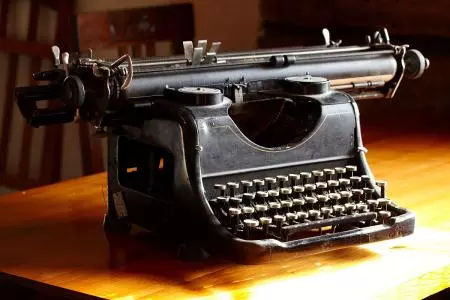

# CRLF、CR、LF详解

> 原文链接： https://blog.csdn.net/lishuoboy/article/details/84768748 
>
> 很长一段时间里，对于CRLF、CR、LF的理解仅限于不同操作系统下对换行符的定义。所谓知其然需知其所以然，从学习中找到乐趣，对知识的记忆才会更加深刻。

## 名词解释

- CR：Carriage Return，对应ASCII中转义字符\r，表示回车
- LF：Linefeed，对应ASCII中转义字符\n，表示换行
- CRLF：Carriage Return & Linefeed，\r\n，表示回车并换行

众所周知，

Windows操作系统采用两个字符来进行换行，即CRLF；

Unix/Linux/Mac OS X操作系统采用单个字符LF来进行换行；

另外，MacIntosh操作系统（即早期的Mac操作系统）采用单个字符CR来进行换行。

## 野史

老式机械打字机（来源：视觉中国）

据野史记载，在很久以前的机械打字机时代，CR和LF分别具有不同的作用：LF会将打印纸张上移一行位置，但是保持当前打字的水平位置不变；CR则会将“Carriage”（打字机上的滚动托架）滚回到打印纸张的最左侧，但是保持当前打字的垂直位置不变，即还是在同一行。

当CR和LF组合使用时，则会将打印纸张上移一行，且下一个打字位置将回到该行的最左侧，也就是我们今天所理解的换行操作。

随着时间的推移，机械打字机渐渐地退出了历史舞台，当初的纸张变成了今天的显示器，打字机的按键也演变为了如今的键盘。在操作系统出现的年代，受限于内存和软盘空间的不足，一些操作系统的设计者决定采用单个字符来表示换行符，如Unix的LF、MacIntosh的CR。他们的意图都是为了进行换行操作，只是当初并没有一个国际标准（或者其他原因，鬼知道），所以才有这样字符上的不同。

## 结论

许多现代的文本编辑器和命令行工具都提供了可选择的换行符配置，方便用户按照自己的意愿来改变换行符的表现形式，所以我们只需要知道CRLF、CR、LF的作用即可。

## 参考文献

[http://en.wikipedia.org/wiki/Newline](https://link.jianshu.com/?t=http%3A%2F%2Fen.wikipedia.org%2Fwiki%2FNewline)
[https://en.wikipedia.org/wiki/Control_character](https://link.jianshu.com/?t=https%3A%2F%2Fen.wikipedia.org%2Fwiki%2FControl_character)
[https://stackoverflow.com/questions/1552749/difference-between-cr-lf-lf-and-cr-line-break-types](https://link.jianshu.com/?t=https%3A%2F%2Fstackoverflow.com%2Fquestions%2F1552749%2Fdifference-between-cr-lf-lf-and-cr-line-break-types)