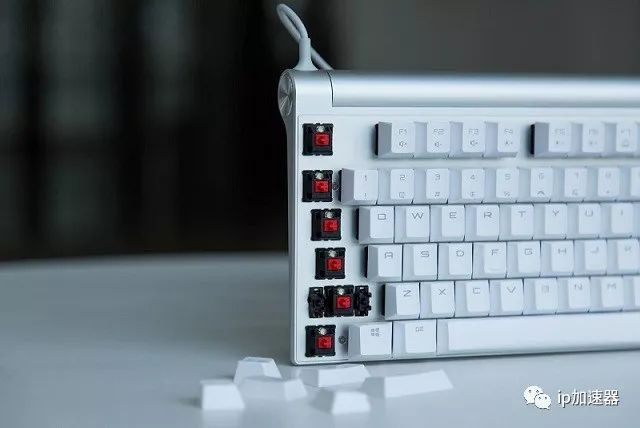
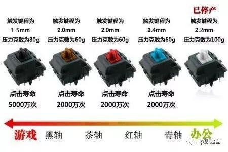
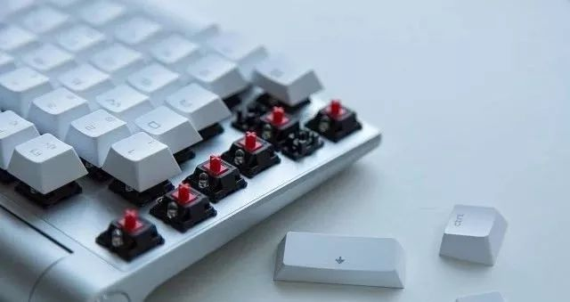
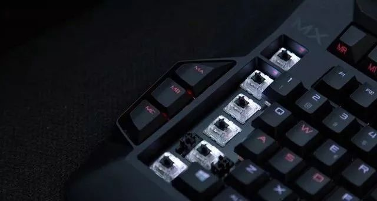
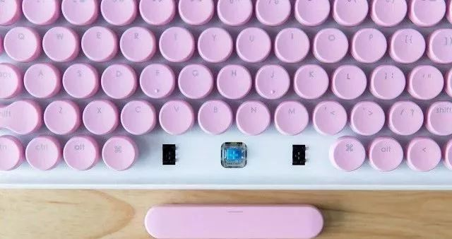
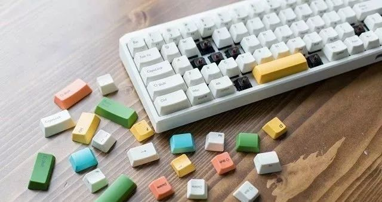

## 机械键盘轴区别？红轴，黑轴，青轴，黑轴怎么选？

> 原文链接： http://www.sohu.com/a/245162464_100021658/ 
>
> 声音比较： 青轴>茶轴>红轴>黑轴

机械键盘是目前最为流行的码字设备，也是众多游戏玩家的标配外设。但机械键盘又分为各种不同的轴体，光是Cherry家的轴体就有数十种，不得不说让玩家们选得是眼花缭乱。那对于初上机械键盘的人来说，该如何去挑选适合自己的机械键盘呢？游戏加速器www.ipdaili.com小编认为，最关键的得先从轴体开始说起。

Cherry机械键盘怎么选？红轴、黑轴、青轴、茶轴的区别

对于机械键盘发烧友来说，Cherry 原厂 MX 机械轴体是最值得信赖的，同时也是信仰所在。不过 Cherry 原厂轴体众多，起码有数十款，对于新手玩家来说，该如何去挑选呢？别慌，尽管轴体众多，但其实归纳下来只有四个轴体，它们分别是：红轴、青轴、茶轴、黑轴。几十种轴体都在这四种基础上衍生而来的。

**红轴、青轴、茶轴、黑轴这四种轴体之间最大的不同，主要是结构，这导致它们在声音、压力、手感上有所区别。**

**1、红轴 Red Switch**

线性轴体，触发键程 2.0mm，初始压力 30cN，触发压力 45 ± 15cN。之所以说红轴是线性轴体，主要是它在按压的时候没有段落感，是直下直上的，同时触发压力较小，使得它在按压的时候需要的力更轻，适合长期码字或者操作键盘的人。

虽然红轴自身的声音不算太大，但 Cherry 还是为它推出了专门的静音版。如果你对机械键盘的「哒哒」声不那么痴迷的话，红轴倒是一个比较平衡的选择。

**2、黑轴 Black Switch**

线性轴体，触发键程 2.0mm，初始压力 30cN，触发压力 60 ± 20cN。可以看到黑轴与红轴一样，皆为线性轴体，但触发压力较大，适合喜欢键盘手感较重、需要大力按压的人，不过对于大多数人来说，长期使用可能会觉得手指较为疲劳。

黑轴估计是四大轴体里面，使用人数最少的了，主要是长期使用容易造成疲劳，使得不少人认为它难用。以我个人的经历来看，黑轴倒也没有那么不堪，如果习惯了它的手感，你会觉得敲下的每个字都「铿锵有力」呢（笑）。

**3、青轴 Blue Switch**

段落轴体，触发键程 2.2mm，初始压力 25cN，触发压力 50 ± 15cN，段落压力 60 ± 15cN，段落行程 1.75mm。虽然触发键程更长一些，但初始压力甚至比红轴还要小，因此敲击起来更为轻松。不过考虑到青轴按压时是有段落感的，会发出「嘀嗒」的声音，有些类似于按压开关的圆珠笔一样，因此声音会较大。

青轴是个友情审判器，主要是如果在办公室或者宿舍里面使用，声音较大容易影响到同事或者同窗，请谨慎使用。如果恰好环境允许，用青轴的话是最有机械键盘那种敲击的节奏感的。

**茶轴 Brown Switch**

段落轴体，触发键程 2.0mm，初始压力 30cN，触发压力 45 ± 20cN，段落压力 55 ± 25cN，段落行程 1.25mm。茶轴是最接近薄膜键盘的轴体，因其虽有段落但并不明显，同时触发压力也较轻，如果是刚从薄膜键盘过渡，选择茶轴倒是比较适合的。同时，段落感的不明显也使得按压时发出的声音比青轴要小一些。

茶轴的粉丝也可谓不少，主要是它兼顾了青轴的段落感和红轴的安静，当然如此一来，它其实特色就不那么明显了，或者说特色就是 —— 中庸。

**总结：**

Cherry机械键盘这四大轴体是我们平时最常见的轴体，也是出货量比较大的轴体，考虑入机械键盘坑的小伙伴们可以从这四个轴体开始，而进阶一些的朋友们，可以考虑一些比较特别的轴体，譬如游戏加速器www.ipdaili.com小编个人就比较喜欢触发非常快的银轴，打字舒服，玩FPS类游戏效率也高建议你也试试看