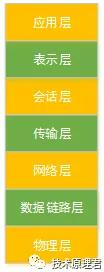
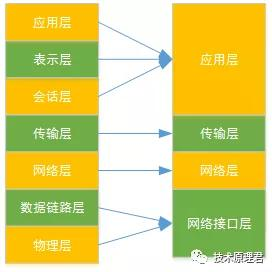
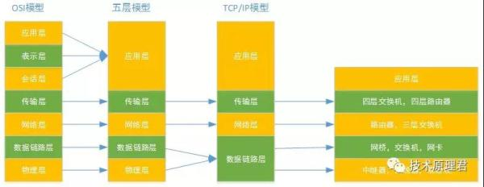

## 网络模型到底是七层，五层，还是四层？

> 原文链接： https://network.51cto.com/art/201907/599657.htm 

我们在做网络开发中，常常会听说到各种协议，比如：tcp，udp，http，ICMP，rtsp，等等。这些协议其实差别非常大，为了更好的理解这些协议。我们需要对网络分层模型要烂熟于心。当前存在三种划分网络模型的方式：

1. OSI七层模型
2. TCP/IP四层模型
3. 五层模型

大家是不是也有疑惑，网络模型为什么搞了这么多的分类?他们具体是怎么分层的?今天我们就带着问题来一探究竟。

**OSI七层模型**

OSI(Open System Interconnection，开放系统互连)七层网络模型称为开放式系统互联参考模型 ，是一个逻辑上的定义，一个规范，它把网络从逻辑上分为了7层。每一层都有相关、相对应的物理设备，比如路由器，交换机。OSI 七层模型是一种框架性的设计方法 ，建立七层模型的主要目的是为解决异种网络互连时所遇到的兼容性问题，其主要的功能使就是帮助不同类型的主机实现数据传输。它的***优点是将服务、接口和协议这三个概念明确地区分开来，通过七个层次化的结构模型使不同的系统不同的网络之间实现可靠的通讯。如下图：

**1.物理层**

OSI模型的***层或***层，该层包括物理连网媒介，如电缆连线连接器。物理层的协议产生并检测电压以便发送和接收携带数据的信号。管物理层不提供纠错服务，但它能够设定数据传输速率并监测数据出错率。网络物理问题，如电线断开，将影响物理层。

**2.数据链路层**

在我的《你真的懂数据链路层》中有过讲解，不再赘述，可自行参考。

**3.网络层**

OSI模型的第三层，其主要功能是将网络地址翻译成对应的物理地址，并决定如何将数据从发送方路由到接收方。网络层通过综合考虑发送优先权、网络拥塞程度、服务质量以及可选路由的花费来决定从一个网络中节点A 到另一个网络中节点B 的***路径。由于网络层处理，并智能指导数据传送，路由器连接网络各段，所以路由器属于网络层。在网络中，“路由”是基于编址方案、使用模式以及可达性来指引数据的发送。 网络层负责在源机器和目标机器之间建立它们所使用的路由。这一层本身没有任何错误检测和修正机制，因此，网络层必须依赖于端端之间的由D L L提供的可靠传输服务。 IP就是属于这一层。

**4.传输层**

OSI模型中最重要的一层。传输协议同时进行流量控制或是基于接收方可接收数据的快慢程度规定适当的发送速率。除此之外，传输层按照网络能处理的***尺寸将较长的数据包进行强制分割。***的当属TCP和UDP了。

**5.会话层**

负责在网络中的两节点之间建立、维持和终止通信。 会话层的功能包括：建立通信链接，保持会话过程通信链接的畅通，同步两个节点之间的对话，决定通信是否被中断以及通信中断时决定从何处重新发送。 例如：DNS

**6.表示层**

应用程序和网络之间的翻译官，在表示层，数据将按照网络能理解的方案进行格式化;这种格式化也因所使用网络的类型不同而不同。 表示层管理数据的解密与加密，如系统口令的处理。例如：telnet

**7应用层**

这个***理解了，不再解释。

七层模型有什么用?

互联网的实现，分成好几层，每一层都有自己的功能，就像建筑物一样，每一层都靠下一层支持。OSI模型就是这样的一个分层，它是一个由国际标准化组织提出的概念模型,试图提供一个使各种不同的终端和网络类型在世界范围内实现互联的标准框架。划分为七层，每层都可以提供抽象良好的接口。

**TCP/IP四层模型**

TCP/IP和OSI模型组并不能精确的匹配，但是我们可以尽可能的参考OSI模型并在其中找到TCP/IP的对应位置。如下图所示，OSI模型到TCP/IP模型映射关系。通常人们认为OSI模型最上面三层(应用层、表示层、会话层)在TCP/IP中是一个应用层。由于TCP/IP有一个相对比较弱的会话层，由TCP和RTP下的打开和关闭连接组成，并在TCP/UDP下的各种应用提供不同的端口号，这些功能被单个的应用程序添加。

在四层，既传输层数据被称作段(Segments);三层网络层数据被称做包(Packages);二层数据链路层时数据被称为帧(Frames);一层物理层时数据被称为比特流(Bits)。其中传输层和网络层被完整保留，因此网络中最核心的技术就是传输层和网络层技术。

TCP/IP四层模型跟OSI模型有什么不一样?

OSI是一个完整的、完善的宏观理论模型;而TCP/IP(参考)模型，更加侧重的是互联网通信核心(也是就是围绕TCP/IP协议展开的一系列通信协议)的分层，因此它不包括物理层，以及其他一些不想干的协议;其次，之所以说他是参考模型，是因为他本身也是OSI模型中的一部分，因此参考OSI模型对其分层。

**五层模型**

五层体系结构包括：应用层、运输层、网络层、数据链路层和物理层。五层协议只是OSI和TCP/IP的综合，实际应用还是TCP/IP的四层结构。下图展示的是OSI模型，TCP/IP模型，五层模型的映射关系。

**五层模型的意义?**

所谓的五层协议的网络体系结构其实是为了方便学习计算机网络原理而采用的，综合了OSI七层模型和TCP/IP的四层模型而得到的五层模型。